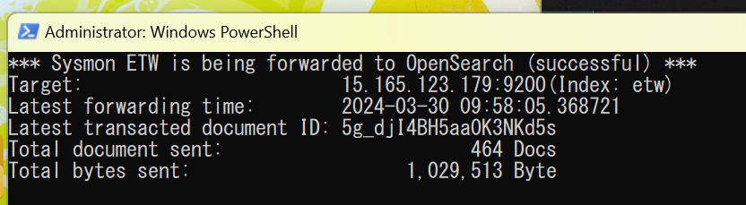

# SysmonLivestream (_under development_)
<div style="white-space: nowrap;">
    
    
    
</div>


<br>




**Deploying** and **streaming** Sysmon(_System Monitor_) livestream log data to data management system like OpenSearch, using **ETW**(_**E**vent **T**racing for **W**indows_)
- Currently supports only forwarding to **OpenSearch**  ✅
- **File** export with time rotation, **ElasticSearch**, and **MongoDB/SQL** will be initiated.

## How does this work
- `SysmonLivestream` only guarantees its operation when the current operating system is official Windows that supports ETW, and runs **with `administrator` privilege**.
- Every time `SysmonLivestream` operates, it will automatically inspect the registry to decide whether Sysmon is appropriately registered. If not, it will automatically download Sysmon from SysInternals, apply Sysmon-Modular ruleset, and activate as a service.
- After initialization, this agent will bring Sysmon log data through ETW and forward it to the expected destination.
- Because ETW is like a queue-based internal log management system, acceptable amount of failure of the target endpoint will be tolerated. The delinquent data supposed to be forwarded will be sent after the endpoint's recovery en bloc.

## Usage
- If you want to run the code as a code itself, don't change the folder and file structures and run `main.py` directly.
- If you want to run as a standalone executable. Run `standaloneBuild.ps1`(PowerShell Script) instead. A few moments later, a single executable will be droped into the project folder as an output.
- This project accepts various of execution parameters. Here are the currently supported options. You need to combinate such options to reach the target destination as expected.
```powershell
PS D:\KnightChaser\SysmonLivestream> python main.py --help
usage: main.py [-h] [--testing] [--opensearch] [--endpoint ENDPOINT] [--account ACCOUNT] [--index INDEX]
               [--checkAndDeploySysmonOffline CHECKANDDEPLOYSYSMONOFFLINE]

options:
  -h, --help            show this help message and exit
  --testing             Testing mode
  --opensearch          Stream logs to OpenSearch database
  --endpoint ENDPOINT   Endpoint to the target service (IP:Port)
  --account ACCOUNT     Account to the target service (username:password)
  --index INDEX         Index name to store the logs
  --checkAndDeploySysmonOffline CHECKANDDEPLOYSYSMONOFFLINE
                        Check if Sysmon service is running or not. If not, deploy Sysmon service (sysmonExePath:sysmonConfigPath)
```

**Example**: (You build the program as a standaloneb build.) You want to forward Sysmon ETW data to OpenSearch API located at `X.X.X.X:9200` and the accessible account is `opensearchetw` with a password of `etw123`. OpenSearch index will be `sysmon`.

```powershell
./main.exe --opensearch --endpoint X.X.X.X:9200 --account opensearchetw:etw123 --index sysmon
```
